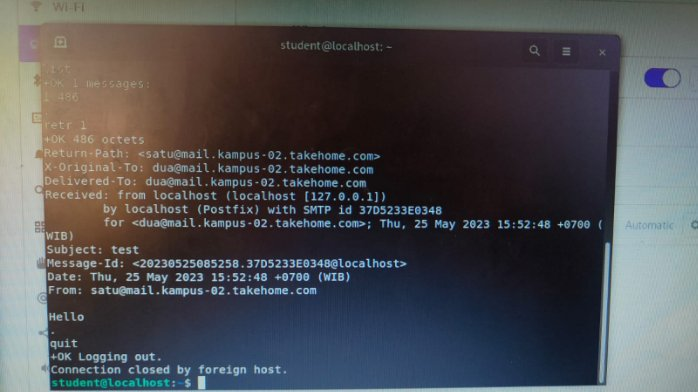

# Kelompok – 2
3121600010 – Arga Rafi I.M

3121600023 – Arianto Zaki Hamdalah

3121600025 – Ahmad Shonhaji

## Mail Server

### 1. Instalasi Postfix

Untuk menginstall postfix, yang pertama kali harus disiapkan adalah webserver (apache). Setelah webserver terinstall, masukkan perintah dibawah untuk menginstall postfix kemudian Enter dan akan tampil beberapa tampilan untuk mengatur konfigurasi dari postfix.

\# sudo apt install postfix
Lalu lakukan konfigurasi sesuai perintah

Setelah itu konfigurasi etc host

Karena terdapat beberapa kendala, tim kami melakukan reconfigurasi postfix seperti di bawah ini.

Lalu restart postfix

Konfigurasi diatas nantinya akan disimpan pada file main.cf pada folder /etc/postfix (nantinya kita akan banyak mengubah konfigurasi pada file ini).

Berikut penampakan isi lengkap seperti di bawah ini:

### 2. Pengetesan Mail
Untuk pengetesan, masukkan perintah

\# telnet mail.kampus-02.takehome.com
pada device client atau bisa menggunakan perintah

\# netstat -lntp | grep :25 pada server
Pengetesan mengirim mail

