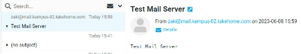


# Kelompok – 2
3121600010 – Arga Rafi I.M

3121600023 – Arianto Zaki Hamdalah

3121600025 – Ahmad Shonhaji

## Mail Server 2
Ini merupakan lanjutan dari percobaan sebelumnya, jadi kami skip bagian awal seperti instalasi postfix, setting postfix, restart postfix dll.

### 1. **Membuat User**
Tuliskan command seperti di bawah ini:

-- maildirmake /etc/skel/Maildir

-- adduser soni

Lalu enter saja sampai proses selesai. Setelah itu buat akun lagi untuk user 2.

### 2. **Instalasi Squirrelmail**
Install Squireel dengan command dibawah ini

-- apt-get install squirrelmail

Setelah selesai edit file di folder /etc/apache2/apache2.conf.
Pada bagian bawah tambahkan configurasi sebagai berikut:

Setelah selesai restart apache2.

### 3. **Test Squirrelmail**
Buka domain tim [www.kampus-02.takehome.com](http://www.kampus-02.takehome.com) lalu akan muncul halaman login Squirrelmail. Setelah itu login dengan akun yang sudah dibuat tadi.

Jika berhasil maka akan masuk kedalam dashboard.

Saya akan mencoba mengirim email ke user lain dengan domain yang sama. Saya mengirim email dari user Zaki ke user Soni di dalam domain yang sama seperti gambar dibawah.

Terlihat bahwa email yang saya kirim sudah terkirim dan bisa dilihat emailnya sudah di terima oleh user soni.

### 4. **Test Email Antar Domain**

Sebelum mencoba untuk mengirim email ke user diluar domain, pastikan bahwa beberapa konfigurasi dibawah ini sudah benar.

- Pastikan urutan DNS benar

- Untuk mengetes domain mana yang connect kita bisa melihat dengan mengetikkan command berikut.
-- nslookup -q=mx (domain mail)

- Pastikan juga setting forward seperti ini, menyesuaikan tiap tim.

Jika sudah maka siap untuk mengirim email ke domain lain.

Berikut merupakan test mengirim email dari user zaki ke domain kampus-05. Terlihat dari kedua sisi sudah saling bisa berkomunikasi.

