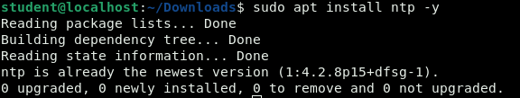

WORKSOP ADMINISTRASI JARINGAN

KELOMPOK – 2

3121600025 – AHMAD SHONHAJI

3121600010 – ARGA RAFI INAL MURTADHO

3121600023 – ARIANTO ZAKI HAMDALAH

1. INSTALL NTP

Menginstall package ntp melalui terminal dengan perintah seperti diatas.

1. KONFIGURASI NTP

Command diatas bertujuan untuk mengakses file konfigurasi ntp.

Saat masuk file konfigurasi pastikan baris code diatas di command “#”.

Ketikkan code diatas pada bagian paling bawah file konfigurasi. Line 1 dan 2 berfungsi untuk menjadikan waktu pada lokal menjadi waktu ntp server. Line 3 dan 4 berfungsi hanya untuk mengijinkan ntp client dari network 192.168.2.0/24

1. RESTART & CEK NTP

Restart service ntp dengan menggunakan command : systemctl restart ntp. Cek keberhasilan konfigurasi dengan menggunakan command ntp -q.

