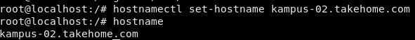
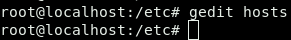
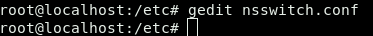


3121600010 – Arga Rafi I.M
3121600025 – Ahmad Shonhaji

3121600023 – Arianto Zaki hamdalah

LAPORAN MINGGU-6 DNS

1. ETC HOSTNAME

Ketikkan pada console terminal seperti gambar dibawah

Pada perintah diatas baris pertama berfungsi untuk mengeset hostname.

Pada baris kedua tes print namahost untuk pengecekan.[^1]

1. ETC HOST

Ketikkan pada cli perintah berikut ini lalu akan membuka file hosts.

Pada gambar diatas dapat diakses dengan perintah bisa dengan nano/gedit atau editor yang lain, contoh : gedit /etc/hosts.

Lalu tambahkan ip dari setiap router kelompok lain bagian interface ethernet 1 seperti gambar diatas.

Setelah selesai menambahkan ip kelompok lain maka akan dilakukan tes ping. Dengan menggunakan command #ping rt01 dan nanti akan diarahkan ke ip sesai daftar ip diatas. 

1. ETC NS SWITCH

Ketikkan pada console seperti di bawah

Maka akan membuka edit untuk file nsswitch.conf

Pada baris ke 12 bisa di balik tetapi secara default akan mengakses file hosts sebelumnya

Pengujian dilakukan dengan menambahkan ip PENS namun di daftarkan dengan nama domain [www.kompas.com](http://www.kompas.com)

Pada pengetesan dengan browser kita mencoba membuka domain [www.kompas.com](http://www.kompas.com) maka yang muncul adalah website PENS seperti gambar dibawah

1. FLOW DNS

[^1]: 